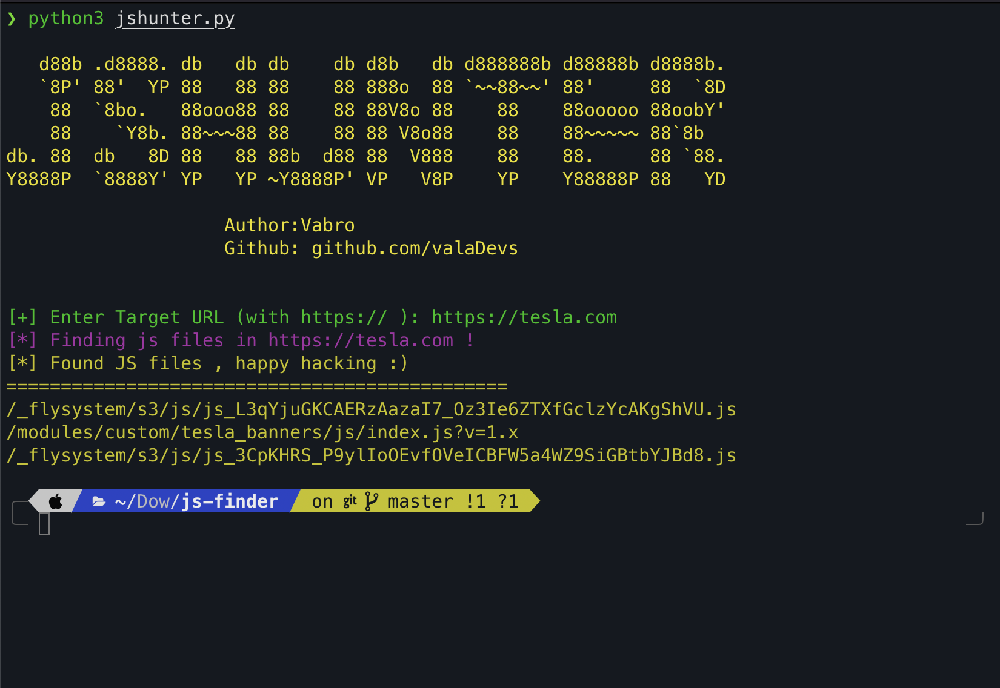

## JSHUNTER
- it's a tool written in python for extracting javascript files from web applications

### How to Use ?
- first clone the repository  
```bash
    git clone https://github.com/valaDevs/jshunter.git
```

- then change direcotory
```bash
cd jshunter
```

- now install packages
```bash
pip install -r requirements.txt
```

- and it's time to hack !
```bash
python3 jshunter.py
```


